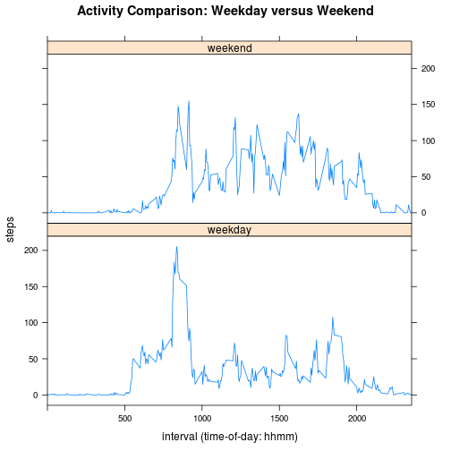

## Introduction

A Samsung smartphone acting as a personal activity monitoring device collected
data at 5 minute intervals through out the day. The data gathered from an
anonymous individual during October and November, 2012, includes the number of 
steps taken daily in each 5-minute interval.

## Loading and preprocessing the data

Fetch monitoring data file, if necessary, and extract monitoring data from 
activity.zip.


```r
if (!file.exists("activity.zip")) {
    url <- "https://d396qusza40orc.cloudfront.net/repdata%2Fdata%2Factivity.zip"
    download.file(url, "activity.zip", "curl", TRUE)
}

if (!file.exists("activity.csv")) {
    unzip("activity.zip")
}
```

Read the activity monitoring data.


```r
df <- read.csv("activity.csv", header = TRUE, na.strings = "NA", 
               stringsAsFactors = FALSE)
```

Translate each interval into corresponding time-of-day (HHMM). Translate each
date into a Date object.


```r
df$interval <- 
    sapply(df$interval, 
           function(x) {
               paste(sprintf("%02g", as.integer(x/100)), 
                     sprintf("%02g", ((x / 100 - as.integer(x/100)) * 100)), 
                     sep="")})

df$date <- as.Date(df$date)
```

## What is mean total number of steps taken per day?

Determine the total number of steps for each day.


```r
steps_per_day = aggregate(steps ~ date, df, sum)
```

Plot a histogram of the daily total number of steps.


```r
hist(x = steps_per_day$steps, freq=TRUE, xlab = "Steps per Day", 
     ylab = "Frequency", col="lightgray", main = "Daily Activity")
```

 

Determine the average (mean and median) number of steps.


```r
steps_average_mean <- as.integer(mean(steps_per_day$steps, na.rm = TRUE))
steps_average_median <- as.integer(median(steps_per_day$steps, na.rm = TRUE))
```

The total number of steps taken per day is 10766 (mean) and the
median is 10765 (median).

## What is the average daily activity pattern?

Plot a graph of the average number of steps per 5-minute interval.


```r
steps_per_interval <- aggregate(steps ~ interval, df, mean)
plot(steps_per_interval, type = "l", 
     main = "Average Daily Activity", xlab = "interval (time-of-day: hhmm)")
```

 

Determine the most active interval across all days.


```r
most_active_interval <- 
    steps_per_interval[which(steps_per_interval$steps ==  
                            max(steps_per_interval$steps)), ]$interval
```

The 5-minute interval, on average across all the days in the dataset, with the
maximum number of steps begins at 
08:35.

## Imputing missing values


```r
missing <- sum(is.na(df$steps))
```

There are 2304 observations without a recorded number of steps in the 
dataset.

To compensate for the intervals with no recorded activity (steps == NA) the 
missing values were assigned the interval median rather than the interval mean, 
daily mean or daily median.


```r
steps <- aggregate(steps ~ interval, df, median)
df$steps <- ifelse(is.na(df$steps), 
                   steps$steps[match(df$interval, steps$interval)], df$steps)
```

Plot a histogram of the daily total number of steps.


```r
steps_per_day = aggregate(steps ~ date, df, sum)
hist(x = steps_per_day$steps, freq=TRUE, xlab = "Steps per Day", 
     ylab = "Frequency", breaks = 5, col="lightgray", 
     main = "Daily Adjusted Activity")
```

 

Determine the average (mean and median) number of steps.


```r
steps_average_mean_adjusted <- as.integer(mean(steps_per_day$steps, na.rm = TRUE))
steps_average_median_adjusted <- as.integer(median(steps_per_day$steps, na.rm = TRUE))
```

The mean is 9503 and the median is 10395 for total number of steps taken per day.

As the histogram shows the decision to use the interval median to replace missing step counts in that interval led to inserting more values between 0 and 5000 with negligable impact upon the other bins. Specifically, the mean decreased from 10766 to 9503 and the median decreased from 10765 to 10395 for total number of steps taken per day. By way of comparison, if the interval mean had been used as a replacement value the mean remained steady at 10766 while the median increased slightly from 10765 to 10766 for total number of steps taken per day. In the latter situation the greatest increase occurred in the bin encompassing the original mean comprised of observations between 10000 and 15000 steps. By choosing interval median as the imputted values a more representative distribution of activity recorded by the Fitbit is achieved.

## Are there differences in activity patterns between weekdays and weekends?

Introduce a factor designating a particular date and its associated intervals as either a weekend or a weekday.


```r
df$daytype <- as.factor(sapply(df$date, function(date) {
    ifelse (grepl('^S', weekdays(date)), "weekend", "weekday")
}))
```


Produce plots covering weekends only and weekdays only for activity comparison.


```r
library(lattice)

steps_per_interval <- aggregate(steps ~ interval + daytype, df, mean)

xyplot(steps ~ interval | daytype,
       data = steps_per_interval,
       type = "l",
       xlim =  c(0:2355, by = 5),
       layout = c(1, 2),
       main = "Activity Comparison: Weekday versus Weekend",
       xlab = "interval (time-of-day: hhmm)")
```

 

Not unexpectedly the overall activity patterns during a 24-hour cycle on weekends (Saturday and Sunday) and weekdays (Monday through Friday) is remarkably different albeit with minor differences during some interval periods. This observation implies the Fitbit users while active throughout the week are significantly more active during the weekend. The same observation occurs whether we select interval mean or interval median to replace non-existent data points for steps taken during corresponding intervals; interval median, however, more accurately reflects expected activity level during a specific interval across time.


